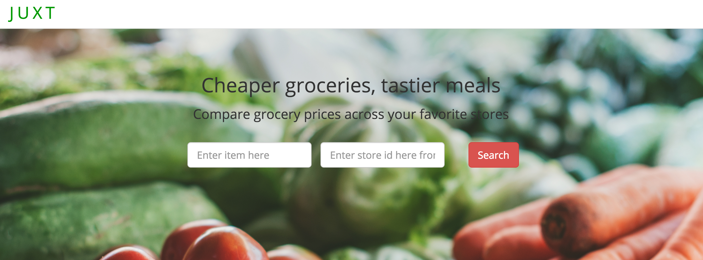
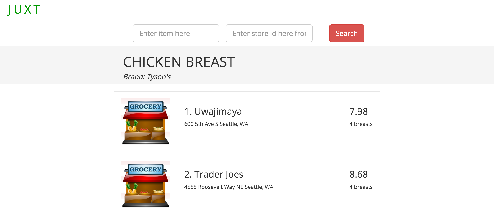

# juxt
### Grocery Price Comparison App
Home Page


Results Page


## Tech
* postgres
* node: koa, knex/bookshelf.js
* ui: react, redux, redux-saga, immutable, superagent

## Developing
* "npm run dev" - runs everything you need for development
* go to http://localhost:8080/
* api server is running on http://localhost:3000/

## Database migrations
* "npm run migrate:latest" migrate to lastest version
* "npm run migrate:rollback" rollback a version
* "npm run migrate:redo" go back and move forward

## Installation

### Setup Postgres

*Install*
Taken from: [here](https://ernestyalumni.wordpress.com/2015/07/09/installing-postgresql-on-a-mac-mac-os-x-tutorial-introduction-on-how-to-run-create-and-run-a-postgresql-database-etc/)
```bash
brew update && brew install postgresql
initdb /usr/local/var/postgres
launchctl load -w ~/Library/LaunchAgents/homebrew.mxcl.postgresql.plist
pg_ctl -D /usr/local/var/postgres -l /usr/local/var/postgres/server.log start
```

*Create User*

```bash
createuser -P -s -e -d juxt
```

Set password to "juxt"

*Create DB*

```bash
createdb juxt
createdb juxt_test
```

### Install Node and project

```bash
git clone https://github.com/jonathanhuang13/juxt.git
cd juxt
brew install node
npm install 
```
